## ASP.NET 项目开发学习记录

## 0x0 前言

&emsp;&emsp; 本文从笔者萌新的视角记录下自己学习ASP.NET的过程。本文主要内容: 获取云服务器->配置好生产环境->编写相应的项目->部署到生产环境。


## 0x1 获取云服务器方式

下面所有活动都必须要进行实名认证和学生认证的，笔者选取的都是知名网络公司，信息和服务质量绝对有保障，可以放心选择。


### 0x1.1 百度云

活动链接:[百度云活动](https://cloud.baidu.com/campaign/Annualceremony-2020/index.html?track=cp:nsem|pf:pc|pp:nsem-huodong-20niandushengdian-BCC|pu:BCC-jingpinci|ci:2020ndsd|kw:2180632#1)

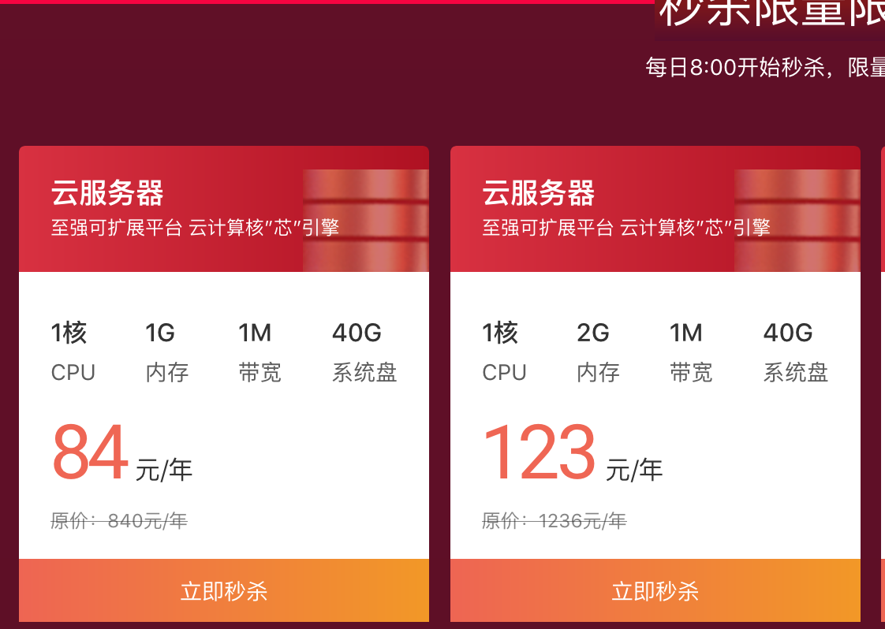

如果你不在乎卡顿的话,建议上手84CHY/年的类型

然后注册账户,上传身份证用支付宝购买即可。(我个人不是很喜欢这个,没买)

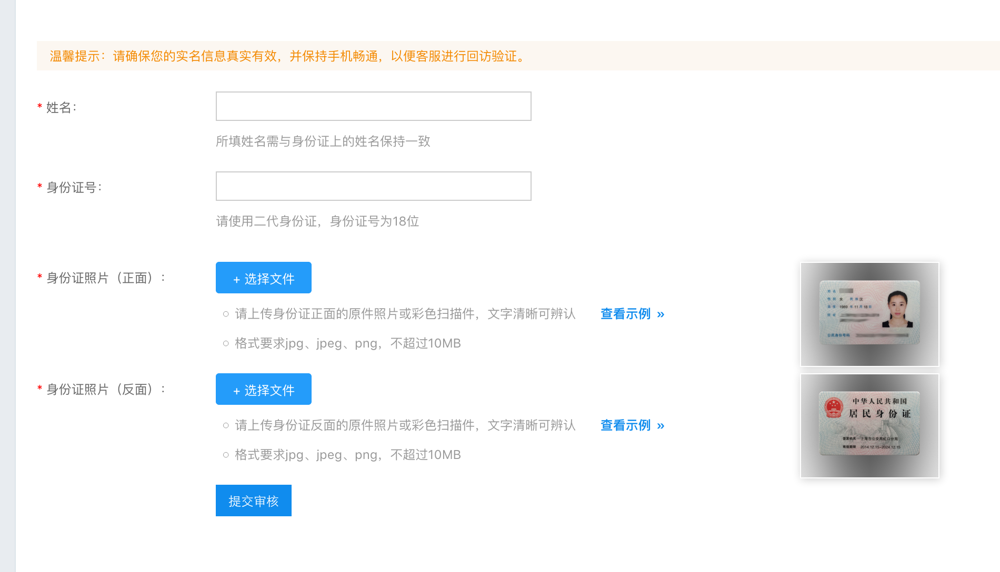


### 0x1.2 腾讯云(强烈推荐)

1. 学生扶持计划

   [腾讯云校园计划](https://cloud.tencent.com/act/campus?fromSource=gwzcw.3004048.3004048.3004048&utm_medium=cpc&utm_id=gwzcw.3004048.3004048.3004048)

2. 开发者专项计划

   [开发者优惠套餐](https://cloud.tencent.com/act/developer?from=11416)

   我个人觉得很棒,1h4g 2m完全可以负担中小型项目了，买3年的话平均下来

   才10CNY/month,可以说非常适合有开发经验的人选择，性价比很给力，购买稍微有点麻烦，不过基本可以百度解决。

   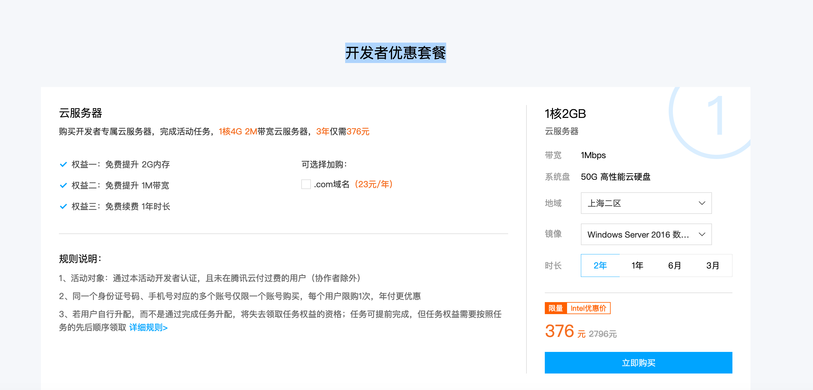

### 0x1.3 阿里云(免费+付费 强推)

**1.免费获取渠道**

[学生在家计划活动链接](https://developer.aliyun.com/adc/student/?userCode=i3ve3is6)

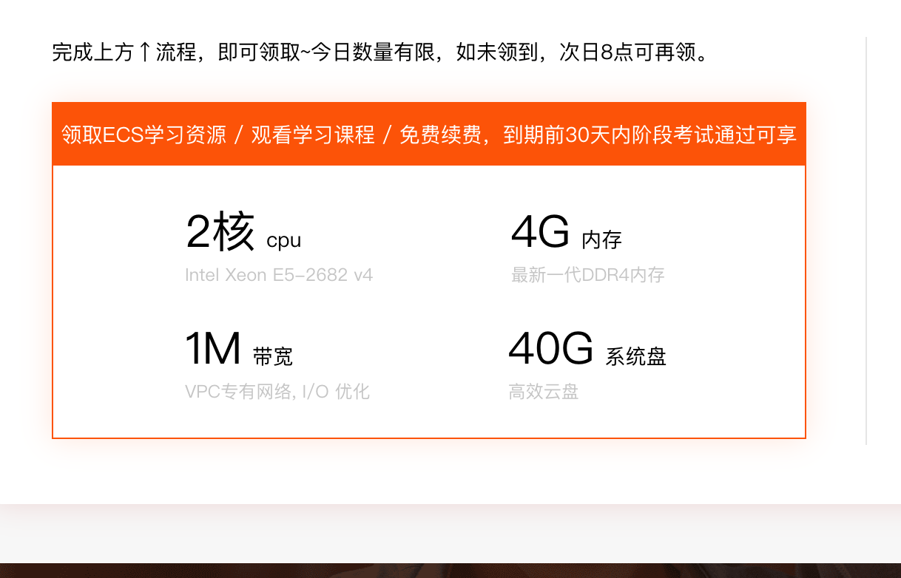

配置非常给力，而且免费使用可达一年，步骤可能有点麻烦，但是一般可以抢到。

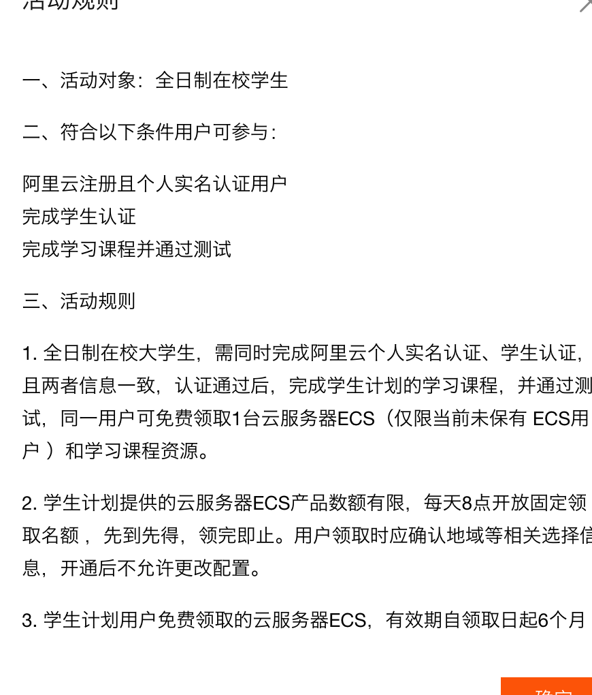

8点准时开抢，都可以获取到。


2.新用户付费渠道

[活动链接](https://www.aliyun.com/minisite/goods?userCode=3j6evlnk&share_source=copy_link)


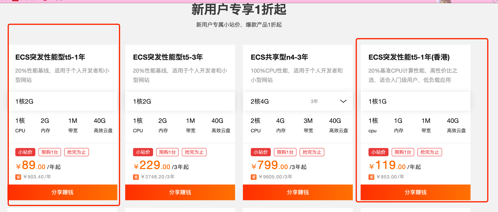

这里有两种选择，你要是便宜的话可以买89CNY/year,但是如果你想要翻墙或者免备案的话推荐花多40买香港的，操作性比较多，娱乐性也好。

**3.学生扶持计划**

笔者一直在用,个人感觉还行, 平时没活动的话，价格可以接受,你可以选择一个月的来购买。不过笔者觉得如果你考虑计算机方向的话，或者想展示点什么的话，建议买一年的，毕竟你学生时间也没几年了，还是挺实惠的。

[云翼计划活动链接](https://www.aliyun.com/activity/promotion/campus2018)

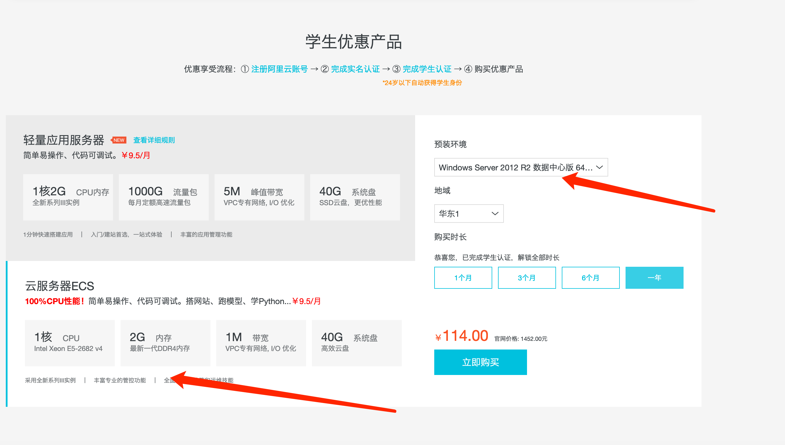


## 0x3 阿里云ecs免费获取流程

&emsp;&emsp;首先我们需要注册个账号并且完成实名和学生认证，可以使用支付宝的验证非常方便。

example:

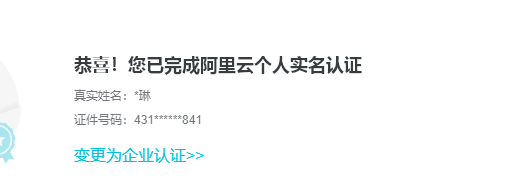


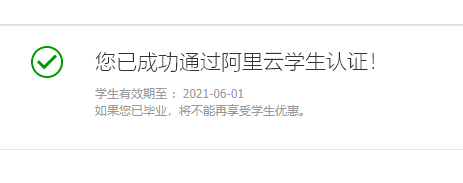

然后我们回到[活动页面](https://developer.aliyun.com/adc/student/?userCode=i3ve3is6)，点击第三步

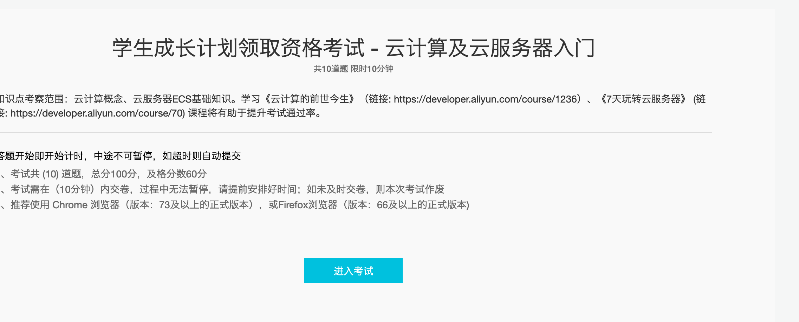

这个考试很简单，百度一下就有答案

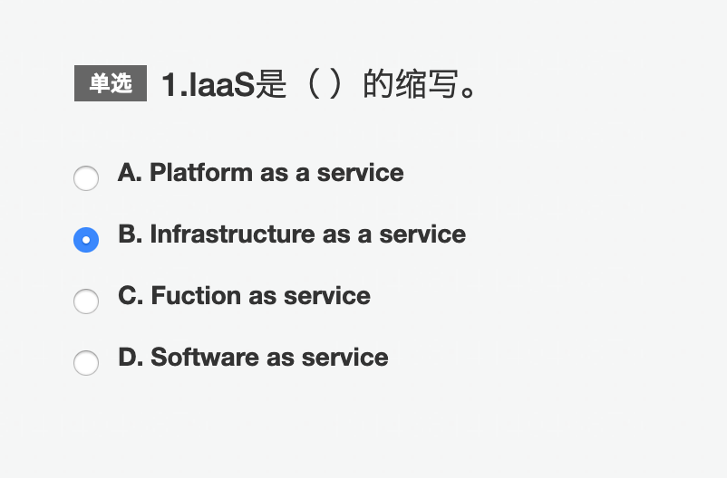

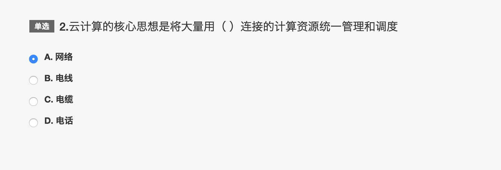

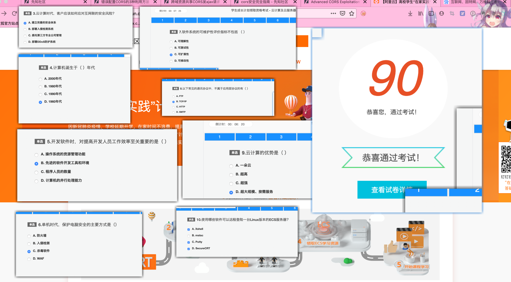

然后我们8点起来抢就好了。


## 0x4 开发一个简单项目

&emsp;&emsp;初步构想是记录下各位同学的ECS IP 和 保存登陆信息的，并且提供一个展示的窗口让大家互相交流学习。

功能点:

1.展示用户的信息

2.登陆

3.添加ECS和信息, 并且提供显示与隐藏按钮


技术栈:

ASP.NET

mssql

bootstrap + jquery


### 0x4.1 前端简单设计

- 1.主页

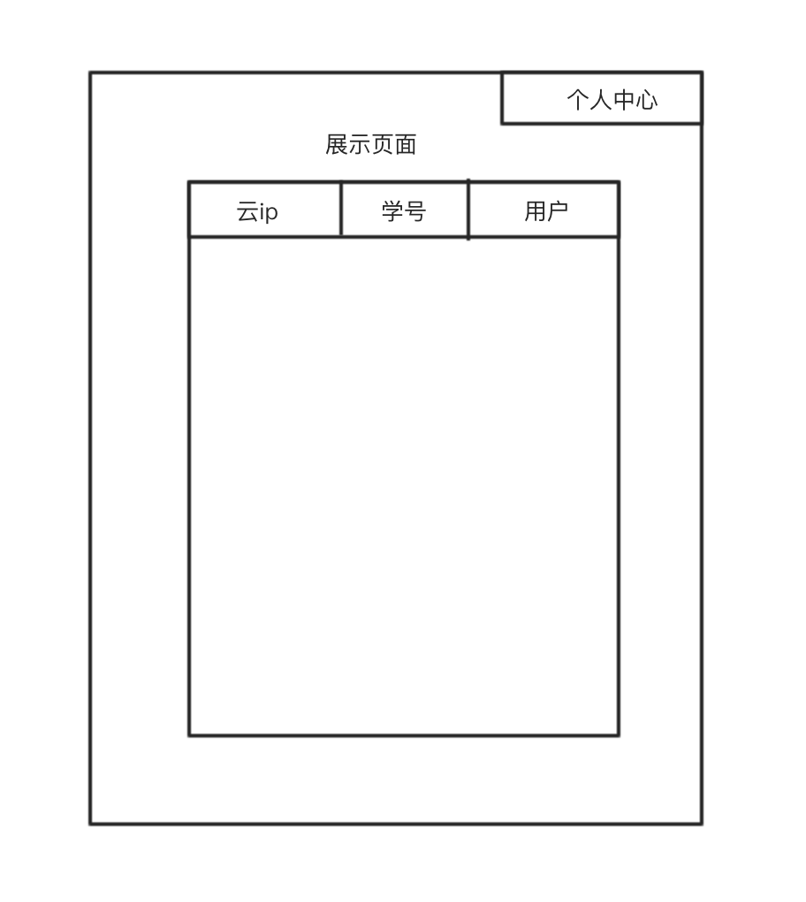

- 2.用户中心

  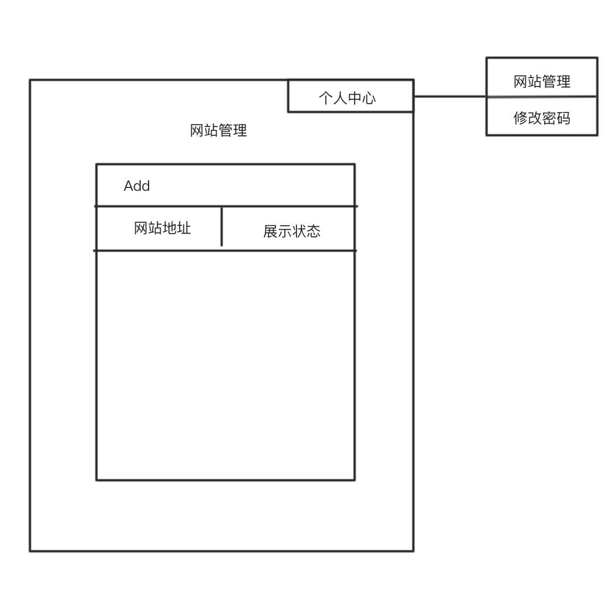

大概花了1个多小时,简略写好了前端代码。

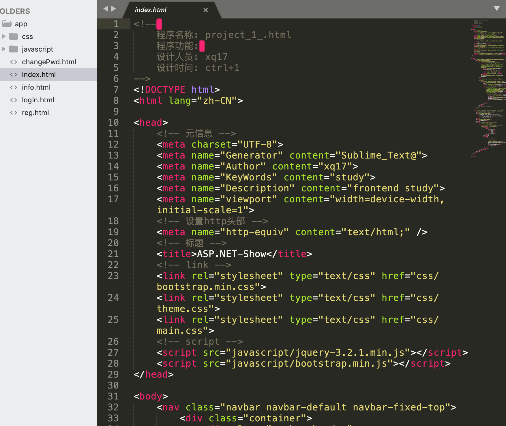


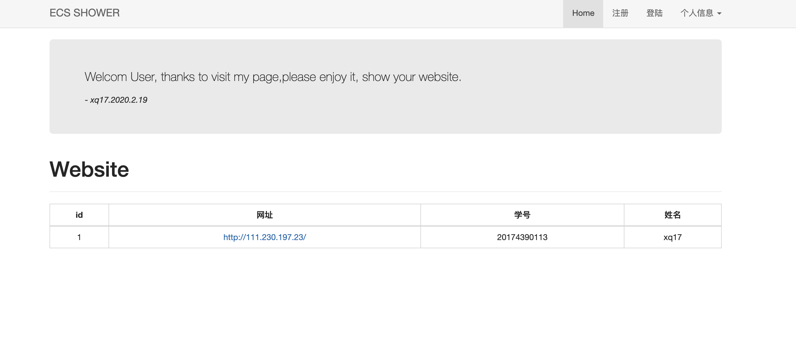

### 0x4.2 数据库设计

`users`表

|   列名   | 数据类型     | 备注        |
| :------: | ------------ | ----------- |
|    id    | int          | primary key |
| username | varchar(255) | 用户名      |
| password | varchar(255) | 密码        |

`domain`表

| 列名     | 数据类型     | 备注        |
| -------- | ------------ | ----------- |
| id       | int          | primary key |
| username | varchar(255) | 用户名      |
| domain   | varchar(255) | 网址        |


然后花几分钟写出相应的sql语句

```sql
USE master;
GO
/*建立空的MyPetShop数据库*/
/*请根据实际环境更改数据库文件和日志文件的存放路径*/
CREATE DATABASE MyStudy
ON 
( NAME = MyPetShop,
    FILENAME = 'C:\WebData\MyStudy.mdf',
    SIZE = 5MB,
    MAXSIZE = 50MB,
    FILEGROWTH = 1MB )
LOG ON
( NAME = MyPetShop_log,
    FILENAME = 'C:\WebData\MyStudy_log.ldf',
    SIZE = 3MB,
    MAXSIZE = 25MB,
    FILEGROWTH = 1MB )
COLLATE Chinese_PRC_CS_AS;
GO
USE MyStudy
/*分别建立Users、Doamin等数据表的结构*/

CREATE TABLE [Users](
	[UserId] int identity PRIMARY KEY,
    [Name] [nvarchar](80) NOT NULL,
    [Password] [nvarchar](80) NOT NULL,
    [StuNumber] [nvarchar](80) NOT NULL)

CREATE TABLE [Domains](
	[DomainId] int identity PRIMARY KEY,
    [StuNumber] [nvarchar](80) NOT NULL,
    [Domain] [nvarchar](255) NOT NULL)

/*在Users表中插入示例数据*/
INSERT INTO [Users] ([Name], [Password], [StuNumber]) VALUES ('xq17', '12334', '20174390113')
/*在Domains表中插入示例数据*/
INSERT INTO [Domains] ([Domain], [StuNumber]) VALUES ('http://111.230.197.23/', '20174390113')
GO

USE master;
GO
```

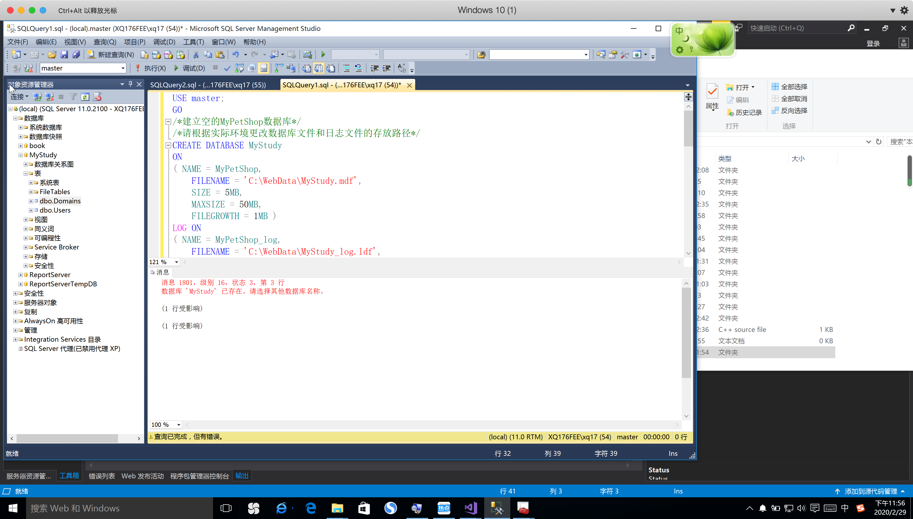

然后在mssql里面执行即可。


### 0x4.3 后端代码设计

[源代码](https://github.com/mstxq17/ECS_SHOWER)，我存放到了github上面。

关于这个程序内容还有好多后面的知识点没学到，所以我都是通过百度等方式了解到了三层架构，数据交互及其母版之类的知识，并且尝试应用到我的项目上,反正写起来很烂，先扔着吧。


### 0x4.3.1 三层架构

- 表示层(Web UI)
- 业务逻辑层(BLL)
- 数据访问层(DAL)

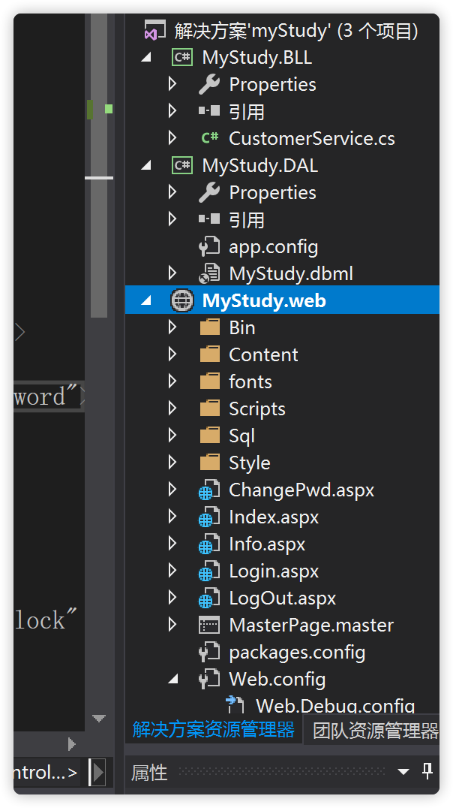

随便敲了点代码,emm，还有很多功能没有实现，主要是还没学到相关的数据用法吧，自己懒得折腾了。


## 0x5 功能测试

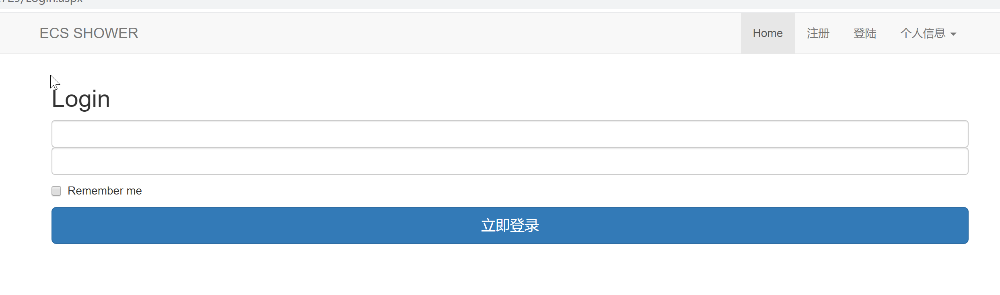


................

这里我就不怎么进行测试了,有兴趣帮我修复的或者二次开发的可以直接从github下载代码，欢迎找我交流，qwq，没有鼠标我真的写起来很难受。


## 0x6 部署项目

这里我利用@小琳同学阿里云活动的ECS进行项目部署。

首先配置环境的时候，我懒得安装了，直接使用现成镜像。

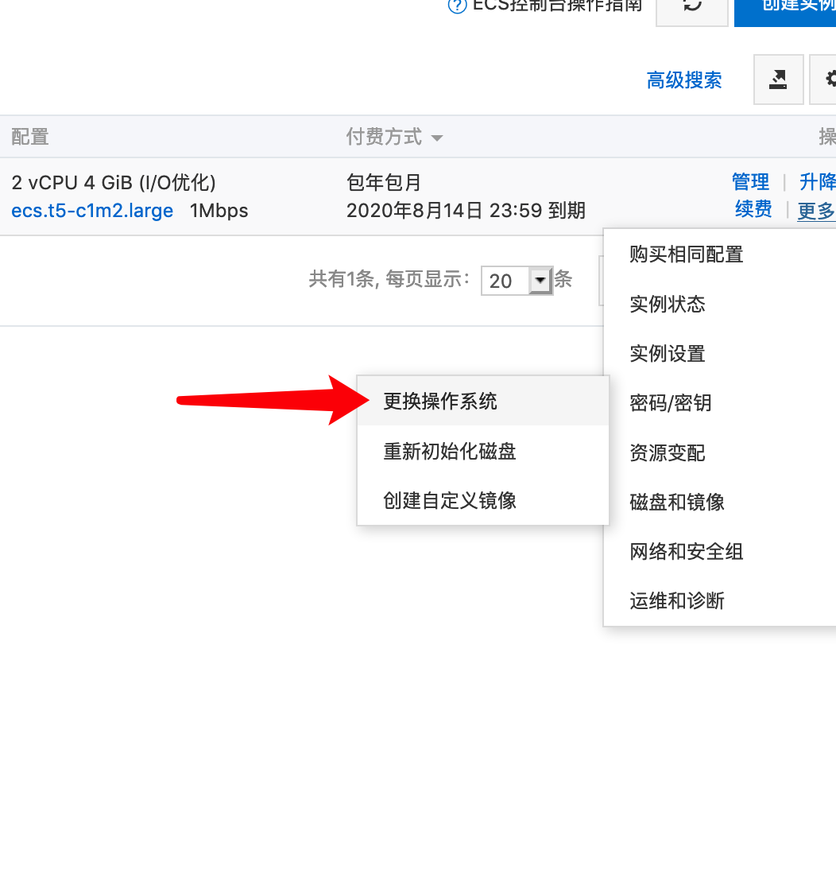


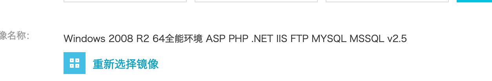

然后选择这个全能的镜像就好了,安全性emm, 默认策略或者之类的(自己测试)。

(PS: 这个卑微的系统没有装mssql, 很无奈，只有mysql，我也是后面才知道的)


然后下面就是很关键的了，就是配置下安全组开放端口,方便我们后面各种测试。

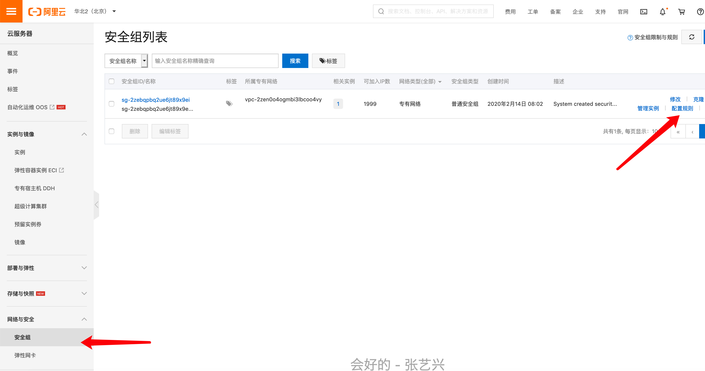

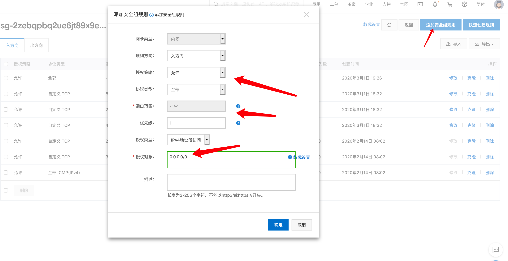

出入方向都需要这样配置。


## 0x6.1 FTP远程部署

我们通过阿里云链接上去,然后在iis搭建个匿名的ftp站点

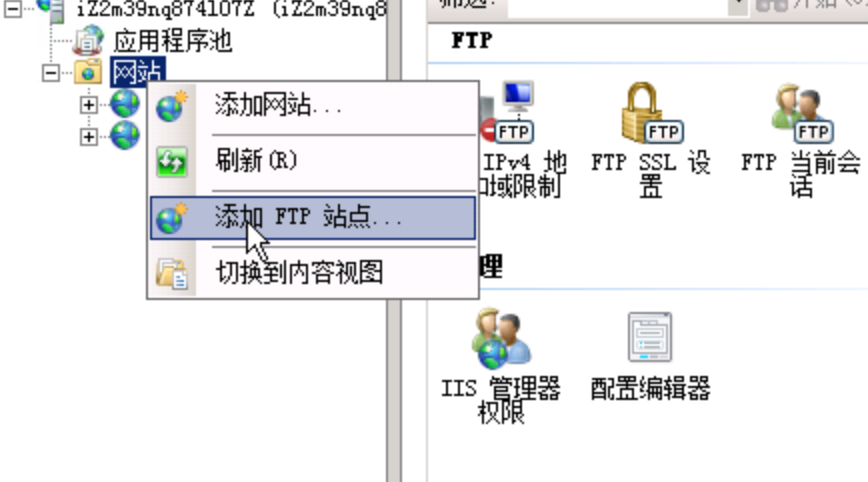


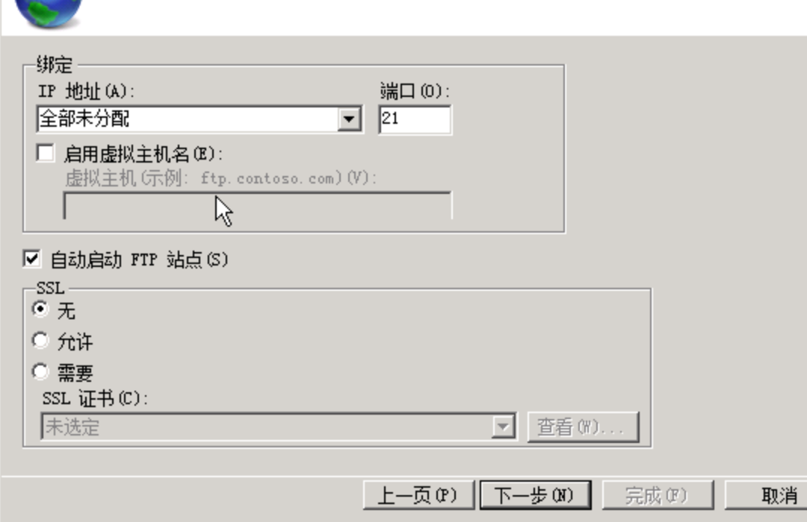

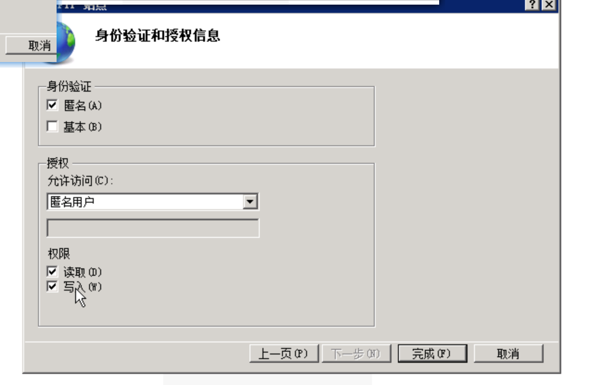

然后即可,然后我们回到开发环境，用vs的发布功能

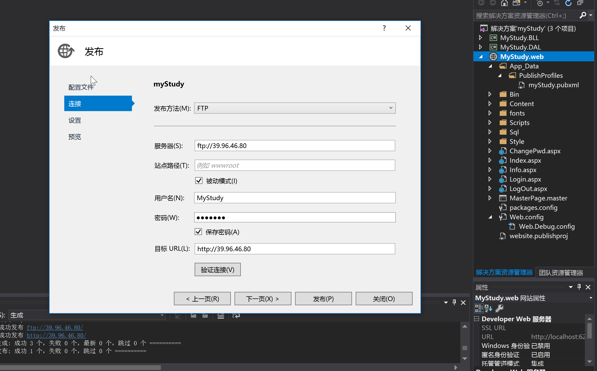

大概这样配置,然后发布的时候会弹出来一个ftp登陆框，记得选择匿名登陆即可，还有一定要选择被动模式，要不然会有一些未知错误。

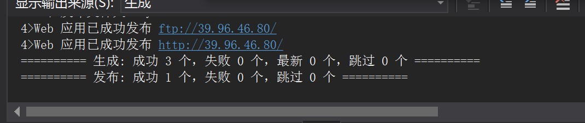

然后等待一下就发布成功，

然后修改下网站的默认文档配置,添加个`Index.aspx`即可。

这样我们就部署成功了。

访问http://39.96.46.80/ 即可以到达页面，但是功能还没有写好，比较懒惰欢迎各位进行二次开发。


**最后记得关闭掉匿名的ftp,要不然等着网站被别人ooxx吧。**

## 0x7 定时备份

### 0x7.1 网站内容备份

- 1.本地开发环境保存了一份源码
- 2.githud保存了一份源代码,方便更新迭代


### 0x7.2 数据内容备份

留等下次我换个镜像或者安装mssql之后再写。

这个比较重要，因为涉及到本地及其远程的差量备份。


## 0x8 开放使用

### 0x8.1 域名注册

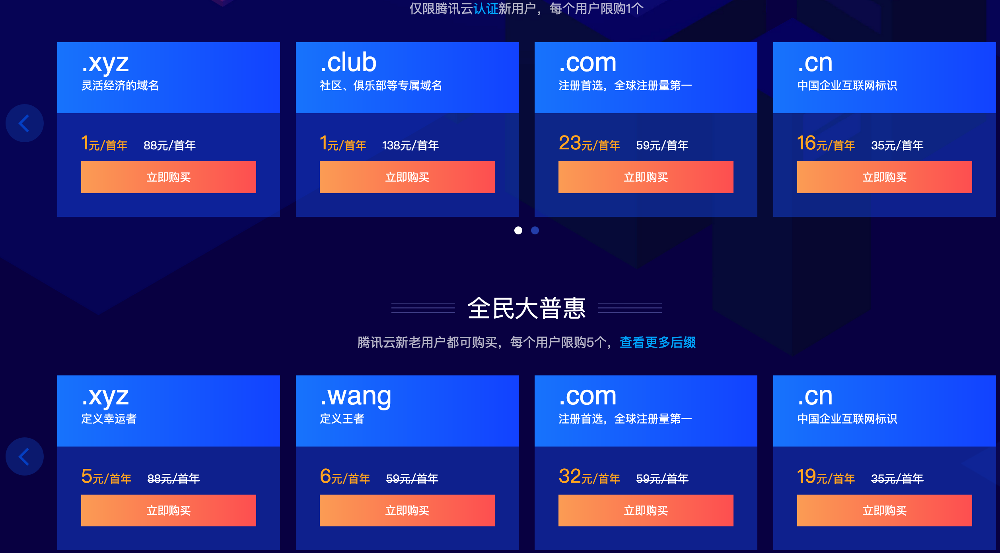

这里首年价格不是很够，新用户只需要1元就可以买一年了。

[购买链接](https://cloud.tencent.com/act/domainsales?from=dnspodqcloud)

你也可以在阿里云买,价格都是这样，我就不去找了。

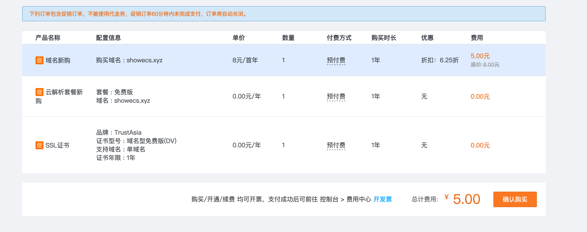


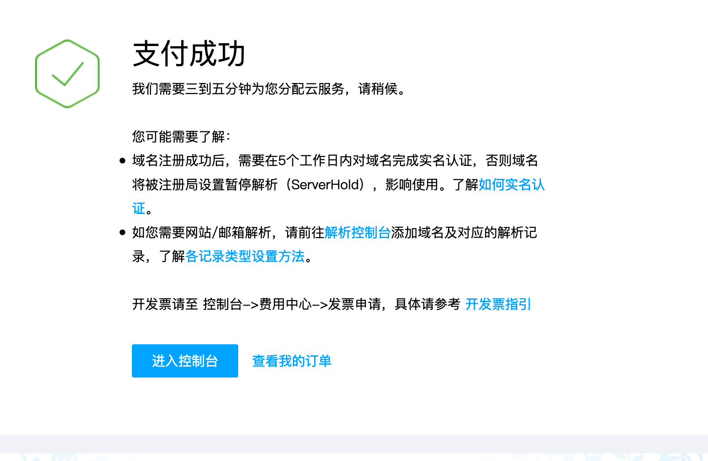

可以看到我们域名注册之后可以暂时用一段时间，但是如果不备案会被封掉，

当然也有绕过的一些方法，就是用国外的服务器，我之前自己也写了个绕过的app,有兴趣研究可以关注我的项目(https://github.com/mstxq17/ForwardAPP)

然后我们添加一条解析记录即可。

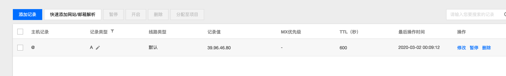

然后等待时间是生效即可

我们访问http://showecs.xyz/ 其实就是访问我们那个阿里云服务器, 这个涉及dns的解析过程。


## 0x9 总结与反思

&emsp;&emsp;纯粹是为了熟悉下ASP.NET的开发过程而做的小实验，关于数据源的展示我就没去学习了，后面有书本我再操作吧，因为很多方案无从去选择。先挖个坑吧，后面有时间我再回来完善这个东西。


## 0x10 感谢

友情感谢赞助@小琳同学(z琳)


